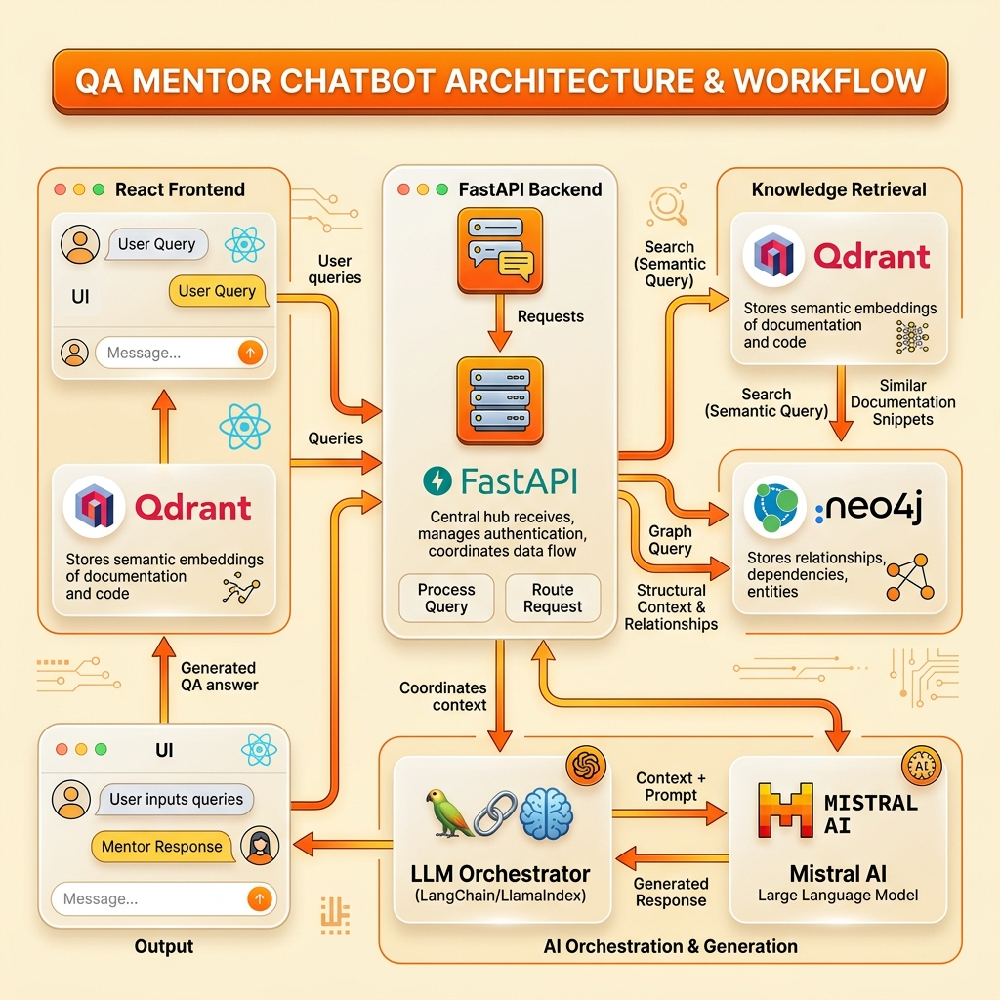

# AI Automation Projects

[](https://python.org)
[](https://python.langchain.com/)
[](https://langflow.org/)
[](#)

Welcome to the **AI Automation Projects** repository. This centralized monorepo houses a suite of state-of-the-art Generative AI pipelines, hybrid Retrieval-Augmented Generation (RAG) architectures, and low-code autonomous agent workflows engineered specifically for **Software Quality Assurance (SQA)**, **Automated Test Generation**, and **API Verification**.

---

## Repository Structure & Project Overview

```text
AI-Automation-Projects/
├── crewai_projects/                       # CrewAI based Multi-Agent workflows
├── langchain_module_projects/              # LangChain & LangGraph Agents
│   ├── Langchain_content_writer_agent/    # LCEL Content Writer & Research Brief Agent
│   └── langgraph_financial_forecast_analysis/ # LangGraph 3-Stage Financial & Equity Valuation Pipeline
├── langchain-hybrid-rag-bm25/             # Production RAG Pipeline (uv, Qdrant, Postgres, BM25)
├── langchain-rag-test-case-legacy-docs/   # Legacy RAG Implementation (Poetry reference)
├── langflow-agents/                       # Custom Langflow Components & API Contract Validators
├── langflow-qa-agents/                    # Curated Langflow Low-Code Agent Workflows (.json)
├── llm_eval_projects/                     # LLM Evaluation Suite (DeepEval, Confident AI, Gemini Judge)
├── qa-chatbot-RAG/                        # Full Adaptive Qdrant RAG Engine & Vite Glassmorphic UI
├── QA_Mentor_ChatBot/                     # Interactive QA Mentorship System & Architecture
└── stlc-agent-tool/                       # STLC Agentic Platform (LangGraph, FastAPI, React)
```

---

### 1. [LangChain & LangGraph Projects (`langchain_module_projects`)](./langchain_module_projects/)

A collection of autonomous agents engineered with **LangChain Expression Language (LCEL)**, **LangGraph state machines**, and dynamic multi-model orchestration.

* **Included Agents**:
  * **[`langgraph_financial_forecast_analysis`](./langchain_module_projects/langgraph_financial_forecast_analysis/)**:
    * **3-Stage LangGraph State Machine**: Orchestrates sequential collaboration across a **Forensic Auditor Node** (Balance sheet, P&L, cash flow scrutiny), an **Independent Verification Officer Node** (fact-checking, anti-hallucination & stress testing), and an **Equity Research Director Node** (executive synthesis & forward-looking valuation).
    * **Fault-Tolerant Multi-LLM Engine**: Multi-tiered failover across **Mistral AI** (`codestral-latest`), **OpenAI** (`gpt-4o-mini`), **Anthropic Claude** (`claude-3-5-sonnet-latest`), and **Google Gemini** (`gemini-1.5-flash`).
    * **Deep Financial Insights**: Outputs institutional valuation reports covering liquidity, solvency, margin trajectories, risk gaps, and multiples analysis.
  * **[`Langchain_content_writer_agent`](./langchain_module_projects/Langchain_content_writer_agent/)**:
    * **Veteran Researcher Persona**: Emulates a senior technical researcher with 10+ years of data extraction and analysis experience to generate in-depth, structured research papers and technical briefs.
    * **Fault-Tolerant Multi-LLM Fallback Engine**: Primary provider powered by **Mistral AI**, with automatic dynamic failover to **OpenAI**, **Anthropic Claude**, and **Google Gemini**.
    * **Modern Dependency Management**: Compatible with both fast Astral **`uv`** and standard **`pip` / `venv`**.

---

### 2. [LangChain Hybrid RAG & BM25 Pipeline (`langchain-hybrid-rag-bm25`)](./langchain-hybrid-rag-bm25/)

A production-grade, multi-modal RAG platform built with modern Python (`uv` package manager) that autonomously analyzes software documentation (PRDs, Jira user stories, architecture diagrams) and generates enterprise-ready QA artifacts.

* **Core Highlights**:
  * **Multi-Modal Document Parsing**: Integrates **Docling OCR** to parse complex PDF layouts, Word documents, and visual architecture diagrams.
  * **Advanced Hybrid Retrieval**: Combines **Qdrant** dense vector similarity search with sparse **BM25** lexical search and **FlashRank** cross-encoder reranking.
  * **Universal Enterprise RAG Setup Prompt (`project_setup_prompt.md`)**: A master meta-prompt enabling architects and developers to instruct AI assistants (ChatGPT, Claude, Gemini, Cursor) to generate complete, zero-hallucination RAG pipelines across any domain or industry by configuring `{DOMAIN_NAME}`, `{USE_CASE}`, and `{INPUT_FORMATS}`.
  * **Curated Domain Use Case Prompts (`use_case_prompts/`)**: Includes industry-specific prompt suites enforcing RFC 4180 single-line CSV formatting for **Legal & Compliance** (`contract_risk_analysis.md`, `clause_redlines.md`, `regulatory_compliance_check.md`), **Business Audit** (`revenue_recognition_audit.md`), **Customer Feedback Analytics** (`churn_root_cause_analysis.md`), and **Healthcare & Clinical Trials** (`clinical_trial_eligibility_matrix.md`, `hipaa_phi_audit_matrix.md`).
  * **Comprehensive SQA Artifact Generation**: Generates structured Test Strategies, Test Plans, Risk Matrices, Requirement Traceability Matrices (RTM), Test Data Matrices, End-to-End Test Cases, and Automation Framework Recommendations.
  * **Continuous Evaluation & Ragas Benchmarking**: Features built-in synthetic testset generation (`generate_300_qa.py`), automated Ragas scoring (Context Precision, Recall, Faithfulness, Answer Relevance), and PostgreSQL feedback loops.
  * **Cloud-Native Deployment**: Includes complete standalone Docker Compose environments and production Kubernetes Helm charts with Horizontal Pod Autoscaling (HPA) and Prometheus monitoring metrics.

---

### 3. [LangChain RAG Legacy Implementation (`langchain-rag-test-case-legacy-docs`)](./langchain-rag-test-case-legacy-docs/)

The original, preserved implementation of the QA Test Case Generation RAG pipeline built using **Poetry**. Maintained as a historical reference and architecture benchmark for backward compatibility.

---

### 4. [Langflow Custom Agents & Contract Validators (`langflow-agents`)](./langflow-agents/)

A collection of custom Python utilities and extensions designed to integrate seamlessly into custom pipelines or Langflow environments.

* **Featured Component (`contract-validator`)**:
  * An automated API verification suite (`validator.py`, `cli.py`, and `langflow_component.py`) that checks HTTP requests and responses against formal OpenAPI/Swagger specifications and JSON schemas.
  * Prevents schema drift and contract violations within automated integration test flows.

---

### 5. [Langflow QA Agent Workflows (`langflow-qa-agents`)](./langflow-qa-agents/)

A curated collection of low-code, drag-and-drop autonomous agent workflows formatted as importable Langflow JSON blueprints (`*.json`).

* **Included Agent Workflows**:
  * **`Test-Case-Generator.json`**: Translates raw user stories and acceptance criteria into comprehensive, edge-case-aware test scripts.
  * **`Test-Plan-Creator.json`**: Synthesizes master test strategies, resource allocations, and scope definitions.
  * **`Bug_Triage_Agent.json`**: Autonomously analyzes incoming bug reports, classifies defects, deduplicates existing issues, and assigns severity/priority ratings.
  * **`RCA-Bot.json`**: A Root Cause Analysis assistant that investigates CI/CD pipeline failures, stack traces, and system logs to pinpoint underlying defects.
  * **`Flaky_Test_Case_generator.json`**: Identifies non-deterministic test patterns and rewrites tests with robust synchronization and assertion mechanisms.
  * **`JSON-Schema-Validator.json`**: Low-code data validation node for payload verification.

---

### 6. [Enterprise QA-Assistant-Chatbot & Adaptive Qdrant RAG Suite (`qa-chatbot-RAG`)](./qa-chatbot-RAG/)

An end-to-end, hardened enterprise Quality Assurance Retrieval-Augmented Generation ecosystem featuring a **Vite + React Glassmorphic UI** wired directly to **Qdrant Vector Engine** and **Vercel AI Gateway**.

👉 **Access the Verified Live Cloud Application**: **[https://qa-rag.vercel.app/](https://qa-rag.vercel.app/)**

* **Core Highlights**:
  * **Adaptive Qdrant Hybrid Retriever (`AdaptiveQdrantHybridRetriever.py`)**: Intercepts quantitative queries (`"how many test cases"`) via Exact Scroll to eliminate semantic hallucination, while performing deep 1024-dimensional Cosine search for scenario queries with strict `0.65` confidence guardrails.
  * **Dynamic Ingestion & Versioning Studio (`qa-assistant-chatbot`)**: Interactive document upload workspace with live `PUT /collections` and `/points` REST API synchronization, custom versioning (`v1` $\rightarrow$ `v2`), and real-time **Langflow API Tweaks** override preview.
  * **Vercel AI Gateway & Multi-Model Orchestration**: Full support for `AI_GATEWAY_API_KEY` (`vck_...`) connecting to `codestral-latest`, `mistral-large-latest`, `open-mistral-nemo`, and `Claude 3.5 Sonnet`, backed by persistent local storage configuration and interactive third-party MCP connection validation (**Jira**, **Confluence**, **GitHub**, **Slack**).
* **Local Setup & Execution Summary**:
  * **Langflow Backend**: Run `docker run -p 7860:7860 langflowai/langflow:latest` or `pip install langflow && langflow run --port 7860`.
  * **Frontend UI**: Navigate to `qa-assistant-chatbot`, run `npm install && npm run dev` (`http://localhost:5173`), and connect your Vercel AI Gateway key right inside the Environment tab!

---

### 7. [QA Mentor ChatBot (`QA_Mentor_ChatBot`)](./QA_Mentor_ChatBot/)

An interactive QA mentorship system designed to guide, review, and assist users in Software Quality Assurance practices.



* **Core Highlights**:
  * **Architecture Insight**: Comprehensive system design including specialized components for retrieval, graph databases, and LLM processing.
  * **Full Stack Mentorship**: Dedicated FastAPI backend with React frontend to provide real-time mentorship and RAG-based context answering.

---

### 8. [STLC Agentic Platform (`stlc-agent-tool`)](./stlc-agent-tool/)

A centralized, AI-driven automation orchestrator for modern Software Testing Life Cycles (STLC) utilizing LangGraph for multi-agent workflows.

* **Core Highlights**:
  * **Intelligent Ingestion**: Legacy test cases and Swagger specs mapped into a Qdrant Vector Database and Neo4j Graph Database.
  * **Zero-Shot Test Generation**: Generates robust API and UI test suites (Playwright/pytest) grounded in RAG contexts.
  * **Heuristic Flaky Detection**: Uses statistical variance across historical runs to identify flaky tests.
  * **Auto-Debugging**: Utilizes Semantic Response Caching to fix code without wasting LLM tokens.
  * **Central Knowledge Hub**: Employs ML clustering to mine test scripts and share reusable automation strategies.

---

### 9. [CrewAI Projects (`crewai_projects`)](./crewai_projects/)

A dedicated workspace for enterprise CrewAI multi-agent automation workflows.

* **Included Projects**:
  * **[`pro1_flaky_testcase_locator_agent`](./crewai_projects/pro1_flaky_testcase_locator_agent/)**:
    * **Autonomous Playwright Diagnostics**: Autonomously retrieves Playwright test execution artifacts (`result.json`) attached to Jira Cloud tickets (or stored in issue descriptions).
    * **Multi-Run Delta & Root Cause Analysis**: Identifies non-deterministic failures, async timing discrepancies, and locator timeouts across disparate test runs to formulate actionable code patches and Markdown RCA reports.
    * **Pluggable LLM Backend**: Dynamic switching across Mistral AI (`codestral-latest`), Groq (`llama-3.3-70b-versatile`), OpenAI (`gpt-4o`), Claude (`claude-3-5-sonnet`), and local Ollama (`qwen2.5-coder:32b`).
    * **Modern Build Tooling**: Fast, deterministic dependency management via `uv sync` and zero-activation execution via `uv run main.py`.

---

### 10. [LLM Evaluation Projects (`llm_eval_projects`)](./llm_eval_projects/)

An enterprise-ready LLM evaluation suite leveraging **DeepEval**, **Confident AI**, and **LLM-as-a-Judge** scoring metrics powered by **Google Gemini**.

* **Included Modules**:
  * **[`deepeval_baisc`](./llm_eval_projects/deepeval_baisc/)**:
    * **Automated Unit Testing with Pytest**: Integrates DeepEval's `assert_test` directly into Pytest test execution to quantitatively benchmark model outputs against golden reference datasets.
    * **LLM-as-a-Judge (`Gemini 3.6 Flash`)**: Uses Google Gemini to score evaluation metrics such as **Answer Relevancy** with configurable passing thresholds (`0.8`), detailed reasoning, latency measurements, and token cost tracking.
    * **Cloud Observability Integration**: Ready for seamless test run synchronization with **Confident AI** for historical regression monitoring and evaluation analytics.

---

## Quick Start Guide

Each project maintains its own dedicated setup guide and dependencies. To get started:

1. **For LangGraph Financial Forecast Agent**:
   Navigate to [`langchain_module_projects/langgraph_financial_forecast_analysis`](./langchain_module_projects/langgraph_financial_forecast_analysis/), copy `configs/.env.example` to `configs/.env`, insert API keys, and run `python main.py`.
2. **For LangChain Content Writer Agent**:
   Navigate to [`langchain_module_projects/Langchain_content_writer_agent`](./langchain_module_projects/Langchain_content_writer_agent/), configure `config/.env` (or copy from `config/.env.example`), and execute with `uv run main.py` or standard `python main.py`.
3. **For Production RAG Generation & Evaluation**:
   Navigate to [`langchain-hybrid-rag-bm25`](./langchain-hybrid-rag-bm25/) and follow the [SETUP.md](./langchain-hybrid-rag-bm25/SETUP.md) instructions using `uv`.
4. **For CrewAI Multi-Agent Workflows**:
   Navigate to [`crewai_projects/pro1_flaky_testcase_locator_agent`](./crewai_projects/pro1_flaky_testcase_locator_agent/), run `uv sync`, copy `config/.env.example` to `config/.env`, and execute `uv run main.py`.
5. **For Langflow Visual Workflows**:
   Launch your local instance of [Langflow](https://github.com/langflow-ai/langflow) (`pip install langflow && langflow run`) and import any JSON workflow from [`langflow-qa-agents`](./langflow-qa-agents/).
6. **For LLM Evaluation Suites**:
   Navigate to [`llm_eval_projects/deepeval_baisc`](./llm_eval_projects/deepeval_baisc/), copy `configs/.env.example` to `configs/.env`, supply your `GOOGLE_API_KEY`, and run `pytest basic_deepeval.py` or `deepeval test run basic_deepeval.py`.

---

## License & Contributing

Contributions, issues, and feature requests are welcome! Feel free to open a pull request or discuss enhancements across any of the included pipelines.

