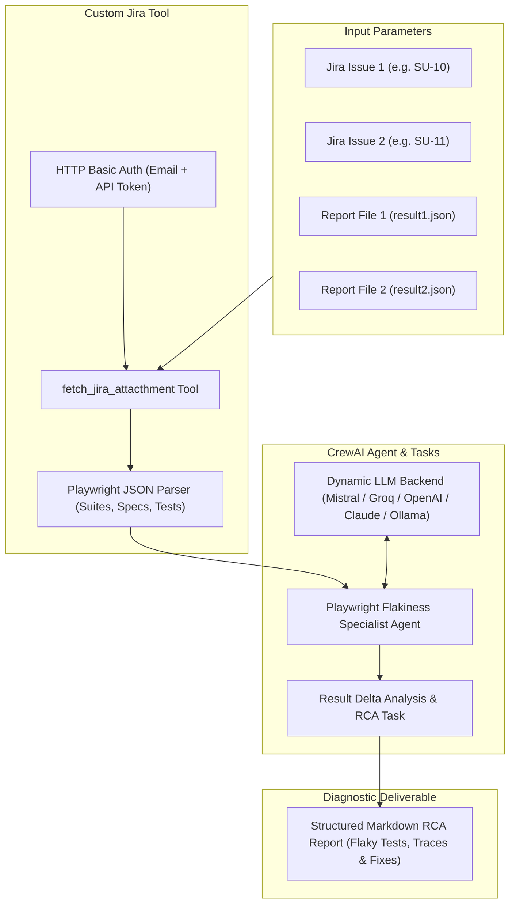

# Playwright Flaky Testcase Locator & Root Cause Analysis Agent

[](https://python.org)
[](https://crewai.com)
[](https://playwright.dev/)
[](https://developer.atlassian.com/cloud/jira/platform/rest/v3/)

An autonomous AI agent powered by **CrewAI** designed to identify, analyze, and diagnose non-deterministic (flaky) **Playwright** test suite executions by fetching and comparing test run artifacts attached to Jira issues.

---

## 📌 Problem Statement

Flaky tests degrade CI/CD pipeline reliability, waste compute resources, and slow down release cycles. Manually cross-referencing multiple execution runs, JSON test reports, and stack traces across different Jira tickets is tedious and error-prone. 

This agent automates the diagnostic workflow by:
1. Connecting directly to the **Jira REST API**.
2. Fetching execution artifacts (`result.json`) across disparate test runs.
3. Comparing delta execution states (Pass vs. Fail/Timeout/Retries).
4. Generating an actionable Root Cause Analysis (RCA) and mitigation plan.

---

## 🏗️ Architecture & Agent Design

The agent is built using **CrewAI** with dynamic LLM provider support and custom Jira tooling.



### 1. Agent Specification
* **Role**: `Playwright Flakiness Specialist`
* **Goal**: Diagnose root causes of non-deterministic Playwright test failures across multiple execution runs.
* **Backstory**: Expert QA Automation Engineer specializing in Playwright debugging, asynchronous race condition detection, timing discrepancies, and selector stabilization.

### 2. Custom Jira Integration Tool
* **Tool Name**: `fetch_jira_attacthment`
* **Functionality**:
  * Authenticates to Jira Cloud REST API v3 using `HTTPBasicAuth`.
  * Locates the target attachment (e.g. `result.json`) for the specified Jira Issue ID.
  * Downloads raw attachment bytes and extracts Playwright JSON test suites, spec titles, line numbers, status flags, and individual test iteration records.
  * Pre-formats JSON data for the agent to optimize token usage.

### 3. Execution Pipeline & Task Design
* **Task Description**:
  1. Retrieve test run data for **Run 1** (`jira_1`, `file_1`).
  2. Retrieve test run data for **Run 2** (`jira_2`, `file_2`).
  3. Load both datasets into structured JSON.
  4. Perform deep comparative analysis across test runs: identify tests that passed in one execution but failed/timed out in another.
  5. Formulate a structured Markdown report summarizing flaky specs, error stack traces, execution deltas, and actionable code fixes.

### 4. Pluggable Multi-LLM Provider Architecture
The agent features a flexible `get_llm()` factory supporting cloud and local inference models:
* **Mistral AI** (`codestral-latest` via Codestral API) — *Default*
* **Groq** (`llama-3.3-70b-versatile`)
* **OpenAI** (`gpt-4o`)
* **Anthropic** (`claude-3-5-sonnet-20241022`)
* **Ollama** (`ollama/qwen2.5-coder:32b` for local private execution)

---

## 📂 Project Structure

```text
pro1_flaky_testcase_locator_agent/
├── agent/
│   ├── __init__.py           # Agent package initializer
│   └── agent.py              # CrewAI Agent, Tool, Task, and LLM definitions
├── config/
│   ├── __init__.py           # Config package initializer
│   ├── .env.example          # Environment variable template
│   └── .env                  # Local credentials (git-ignored)
├── main.py                   # Main entry point to execute the agent workflow
├── pyproject.toml            # Project dependencies and packaging configuration (uv/PEP 621)
├── requirements.txt          # Exported pip dependencies
├── uv.lock                   # Deterministic dependency lockfile
└── README.md                 # Project documentation
```

---

## 🚀 Building & Setting Up the Agent

### Prerequisites
* **Python**: `3.10` to `< 3.14`
* **Package Manager**: [`uv`](https://docs.astral.sh/uv/) (strongly recommended for fast, deterministic builds) or `pip`
* **Jira Cloud Account**: API token with read permissions for issues & attachments
* **LLM Provider API Key**: (e.g. Mistral AI, Groq, OpenAI, Anthropic, or a local Ollama instance)

### 1. Build Environment & Install Dependencies

#### Option A: Using `uv` (Recommended)

1. Navigate to the agent project directory:
   ```bash
   cd crewai_projects/pro1_flaky_testcase_locator_agent
   ```
2. Build the environment and sync dependencies directly from `uv.lock` / `pyproject.toml`:
   ```bash
   uv sync
   ```
   > **Note**: `uv sync` automatically creates a local virtual environment (`.venv`) and installs all locked dependencies including CrewAI and LiteLLM.

#### Option B: Using standard `pip` / `venv`

1. Navigate to the agent project directory:
   ```bash
   cd crewai_projects/pro1_flaky_testcase_locator_agent
   ```
2. Create and activate a virtual environment:
   ```bash
   # Create virtual environment
   python -m venv .venv

   # Activate on Windows (PowerShell / Command Prompt):
   .venv\Scripts\activate

   # Activate on Linux / macOS:
   source .venv/bin/activate
   ```
3. Install dependencies:
   ```bash
   pip install -r requirements.txt
   ```

---

### 2. Configure Environment Variables

1. Copy `.env.example` into a new `.env` file in the `config/` directory:
   ```bash
   # Windows (PowerShell)
   Copy-Item config/.env.example config/.env

   # Linux / macOS / Bash
   cp config/.env.example config/.env
   ```

2. Open `config/.env` and configure your credentials:

   ```ini
   # Active LLM Provider: 'mistral' | 'groq' | 'openai' | 'anthropic' | 'ollama'
   ACTIVE_LLM_PROVIDER="mistral"

   # Mistral Configuration (Default)
   MISTRAL_MODEL=mistral/codestral-latest
   MISTRAL_API_KEY=your_mistral_api_key_here

   # Groq (Optional)
   GROQ_API_KEY=your_groq_api_key_here

   # OpenAI (Optional)
   OPENAI_API_KEY=your_openai_api_key_here

   # Anthropic (Optional)
   ANTHROPIC_API_KEY=your_anthropic_api_key_here

   # Jira Cloud API Configuration
   JIRA_API_TOKEN=your_jira_api_token_here
   JIRA_EMAIL=your_email@example.com
   JIRA_SERVER=https://your-domain.atlassian.net
   ```

---

## 💻 Executing the Agent

You can execute the diagnostic workflow using either `main.py` (recommended entry point) or directly via `agent/agent.py`.

### 1. Configure Target Jira Issues & Reports

In [main.py](file:///d:/ai_3x_qa/AI-Automation-Projects/crewai_projects/pro1_flaky_testcase_locator_agent/main.py), specify the two Jira ticket IDs and attachment filenames (or issue descriptions containing the test run JSONs) you wish to cross-reference:

```python
inputs = {
    "jira_1": "SU-10",          # First Jira ticket containing Playwright test run
    "jira_2": "SU-11",          # Second Jira ticket containing Playwright test run
    "file_1": "result1.json",   # First Playwright JSON report attachment
    "file_2": "result2.json",   # Second Playwright JSON report attachment
}
```

### 2. Run the Workflow

#### Using `uv run` (No manual venv activation required):
```bash
uv run main.py
```

#### Or Using Activated Virtual Environment (`python`):
```bash
python main.py
```

---

## 📊 Sample Output Report

The agent fetches the attachments, parses the spec results across runs, identifies inconsistencies, and produces a complete RCA:

```markdown
--------------Flaky Test Analysis Report-----------------
Prompt Tokens: 3241
Completion Tokens: 842
Total Tokens:  4083

# Non-Deterministic / Flaky Test Analysis Report

## 1. Executive Summary
- **Total Specs Evaluated**: 14
- **Consistent Passing Specs**: 12
- **Flaky / Inconsistent Specs**: 2

## 2. Identified Flaky Test Cases
| Spec ID | Spec Title | Run 1 (SU-10) | Run 2 (SU-11) | Failure Type |
| :--- | :--- | :--- | :--- | :--- |
| `[spec_03]` | `Checkout -> Submit Payment` | **PASS** | **FAIL (Timeout 30000ms)** | Async Race Condition |
| `[spec_07]` | `User Profile -> Update Avatar` | **FAIL** | **PASS** | Dynamic DOM Loading |

## 3. Root Cause Analysis & Recommendations
...
```
