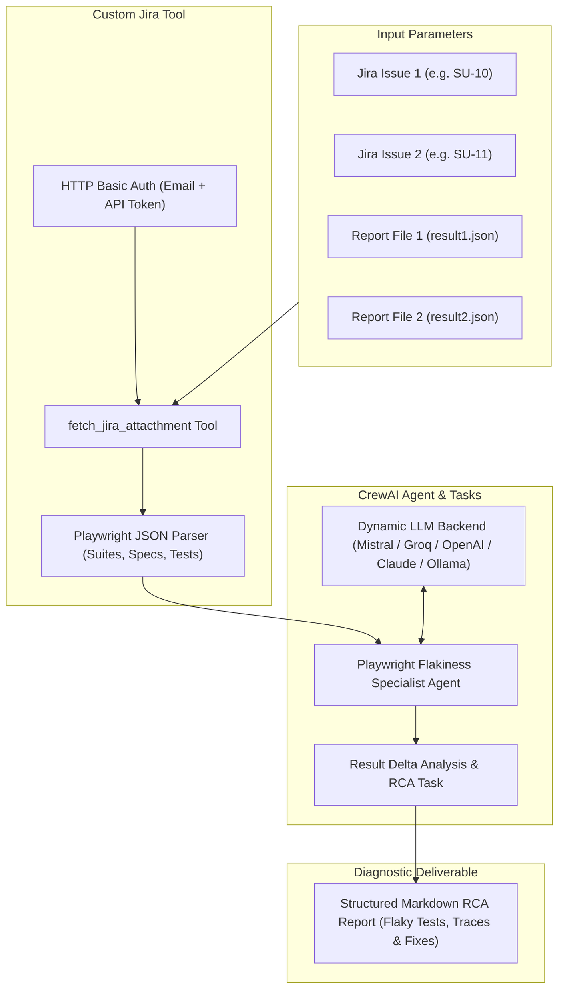

# Playwright Flaky Testcase Locator & Root Cause Analysis Agent

[](https://python.org)
[](https://crewai.com)
[](https://playwright.dev/)
[](https://developer.atlassian.com/cloud/jira/platform/rest/v3/)

An autonomous AI agent powered by **CrewAI** designed to identify, analyze, and diagnose non-deterministic (flaky) **Playwright** test suite executions by fetching and comparing test run artifacts attached to Jira issues.

---

## 📌 Problem Statement

Flaky tests degrade CI/CD pipeline reliability, waste compute resources, and slow down release cycles. Manually cross-referencing multiple execution runs, JSON test reports, and stack traces across different Jira tickets is tedious and error-prone. 

This agent automates the diagnostic workflow by:
1. Connecting directly to the **Jira REST API**.
2. Fetching execution artifacts (`result.json`) across disparate test runs.
3. Comparing delta execution states (Pass vs. Fail/Timeout/Retries).
4. Generating an actionable Root Cause Analysis (RCA) and mitigation plan.

---

## 🏗️ Architecture & Agent Design

The agent is built using **CrewAI** with dynamic LLM provider support and custom Jira tooling.



### 1. Agent Specification
* **Role**: `Playwright Flakiness Specialist`
* **Goal**: Diagnose root causes of non-deterministic Playwright test failures across multiple execution runs.
* **Backstory**: Expert QA Automation Engineer specializing in Playwright debugging, asynchronous race condition detection, timing discrepancies, and selector stabilization.

### 2. Custom Jira Integration Tool
* **Tool Name**: `fetch_jira_attacthment`
* **Functionality**:
  * Authenticates to Jira Cloud REST API v3 using `HTTPBasicAuth`.
  * Locates the target attachment (e.g. `result.json`) for the specified Jira Issue ID.
  * Downloads raw attachment bytes and extracts Playwright JSON test suites, spec titles, line numbers, status flags, and individual test iteration records.
  * Pre-formats JSON data for the agent to optimize token usage.

### 3. Execution Pipeline & Task Design
* **Task Description**:
  1. Retrieve test run data for **Run 1** (`jira_1`, `file_1`).
  2. Retrieve test run data for **Run 2** (`jira_2`, `file_2`).
  3. Load both datasets into structured JSON.
  4. Perform deep comparative analysis across test runs: identify tests that passed in one execution but failed/timed out in another.
  5. Formulate a structured Markdown report summarizing flaky specs, error stack traces, execution deltas, and actionable code fixes.

### 4. Pluggable Multi-LLM Provider Architecture
The agent features a flexible `get_llm()` factory supporting cloud and local inference models:
* **Mistral AI** (`codestral-latest` via Codestral API) — *Default*
* **Groq** (`llama-3.3-70b-versatile`)
* **OpenAI** (`gpt-4o`)
* **Anthropic** (`claude-3-5-sonnet-20241022`)
* **Ollama** (`ollama/qwen2.5-coder:32b` for local private execution)

---

## 📂 Project Structure

```text
pro1_flaky_testcase_locator_agent/
├── agent/
│   └── agent.py              # CrewAI Agent, Tool, Task, and LLM definitions
├── config/
│   ├── .env.example          # Environment variable template
│   └── .env                  # Local credentials (git-ignored)
├── main.py                   # Entry point
├── pyproject.toml            # Project dependencies and packaging configuration
├── requirement.txt           # Pip dependencies
├── uv.lock                   # Deterministic lockfile
└── README.md                 # Project documentation
```

---

## 🚀 Getting Started

### Prerequisites
* Python 3.10+
* `uv` (recommended) or `pip`
* Jira Cloud Account with an API Token

### 1. Installation

Using **uv**:
```bash
cd crewai_projects/pro1_flaky_testcase_locator_agent
uv sync
```

Or using **pip / virtualenv**:
```bash
python -m venv .venv
# On Windows:
.venv\Scripts\activate
# On Linux/macOS:
source .venv/bin/activate

pip install -r requirement.txt
```

### 2. Configure Environment Variables

Copy the `.env.example` file to `config/.env`:

```bash
cp config/.env.example config/.env
```

Edit `config/.env` with your credentials:

```ini
# Active LLM Provider: 'mistral' | 'groq' | 'openai' | 'anthropic' | 'ollama'
ACTIVE_LLM_PROVIDER="mistral"

# Mistral LLM
MISTRAL_MODEL=mistral/codestral-latest
MISTRAL_API_KEY=your_mistral_api_key_here

# Jira Configuration
JIRA_API_TOKEN=your_jira_api_token_here
JIRA_EMAIL=your_email@example.com
JIRA_SERVER=https://your-domain.atlassian.net
```

---

## 💻 Usage

Run the agent script:

```bash
python agent/agent.py
```

### Example Input Configuration:
```python
inputs = {
    "jira_1": "SU-10",          # First Jira ticket with Playwright report
    "jira_2": "SU-11",          # Second Jira ticket with Playwright report
    "file_1": "result1.json",   # First attachment filename
    "file_2": "result2.json",   # Second attachment filename
}
```

### Sample Output Report
The agent delivers an analysis report including:
* **Flaky Test Summary**: Table of specs with status deltas (e.g. `Run 1: PASS` vs `Run 2: FAIL`).
* **Failure Analysis**: Extracted error messages, locator timeouts, or unhandled promise rejections.
* **Root Cause Assessment**: Identified synchronization issues (e.g. missing `waitForURL`, race conditions, dynamic DOM rendering).
* **Recommended Code Fix**: Concrete Playwright code snippet adjustments (e.g., using `toBeVisible()` assertions instead of arbitrary timeouts).
* **Token Usage Metrics**: Detailed prompt, completion, and total token accounting.
