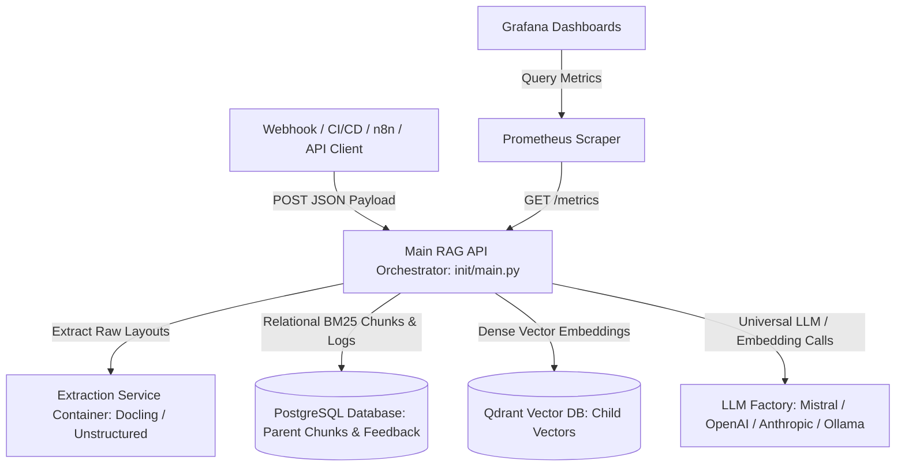
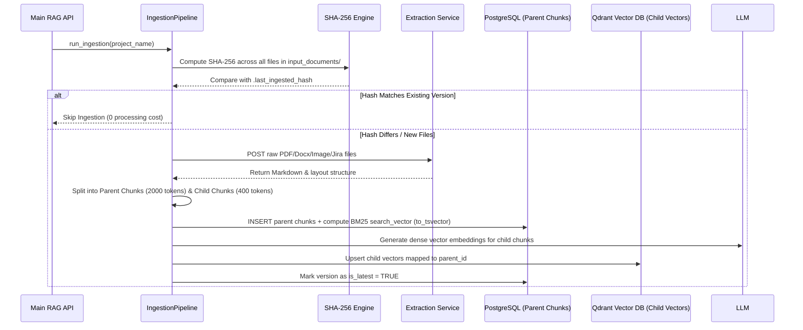
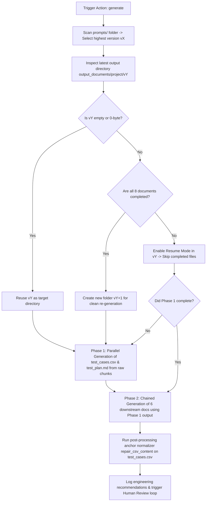

# Low-Level Architecture & Design Specification (LLD)

This document provides the definitive low-level engineering design, module mapping, data flow diagrams, guardrails, constraints, and failback mechanisms for the **Enterprise QA Test Case Generation RAG Pipeline**.

---

## Table of Contents
1. [Executive Architecture & Topology](#1-executive-architecture--topology)
2. [Complete Folder & Script Directory Mapping](#2-complete-folder--script-directory-mapping)
3. [Core Operational Workflows & Design Flows](#3-core-operational-workflows--design-flows)
   - [A. Ingestion & Dual-Indexing Flow (`inject`)](#a-ingestion--dual-indexing-flow-inject)
   - [B. Hybrid RAG Retrieval & Re-Ranking Flow (`retrieve`)](#b-hybrid-rag-retrieval--re-ranking-flow-retrieve)
   - [C. Chained Generation & Smart Resume Flow (`generate`)](#c-chained-generation--smart-resume-flow-generate)
   - [D. Evaluation & Human Review Loop Flow (`evaluate` / `review`)](#d-evaluation--human-review-loop-flow-evaluate--review)
4. [System Guardrails & Constraints](#4-system-guardrails--constraints)
5. [Failback Mechanisms & Self-Healing Resilience](#5-failback-mechanisms--self-healing-resilience)

---

## 1. Executive Architecture & Topology

The system is constructed as a decoupled, asynchronous microservices architecture designed to operate across Docker Compose standalone servers or cloud-native Kubernetes clusters (EKS/AKS/bare-metal).

---

## 2. Complete Folder & Script Directory Mapping

Every script and directory in the project serves a single, highly decoupled engineering responsibility:

| File / Folder Path | Engineering Role & Architectural Responsibility |
|---|---|
| `init/main.py` | **API Orchestrator Entrypoint:** Defines FastAPI REST routes (`/webhook/test-case-generation`, `/webhook/retrieve`, `/webhook/human-review`, `/feedback/review`). Dispatches asynchronous background tasks, initializes action loggers, and mounts Prometheus `/metrics`. |
| `scripts/config.py` | **Configuration Engine:** Centralized parameters loading from `.env`. Implements dynamic OS-aware path normalization (translating WSL `/mnt/c/` or `/mnt/d/` drive paths into native Windows paths `C:\` / `D:\` during local execution) and 3-tier hierarchy resolution. |
| `scripts/llm_factory.py` | **Universal LLM & Embedding Router:** Abstract factory instantiating LangChain chat models and embedding clients dynamically based on `LLM_PROVIDER` (`mistral`, `openai`, `anthropic`, `ollama`, `vertexai`). |
| `scripts/database.py` | **Relational Database Manager (`PostgresDB`):** Manages connection pools and executes DDL/DML for `parent_chunks` (storing 2000-token blocks and SHA-256 hashes), precomputing BM25 full-text indices (`to_tsvector`), and managing `evaluation_feedback`. Implements connection self-healing (`ensure_connection()`). |
| `scripts/rate_limiter.py` | **Throughput Pacing & Adaptive Limiting:** Token-bucket rate limiter (`AdaptiveRateLimiter`) regulating requests to external LLM endpoints. Implements automatic step-down pacing upon encountering HTTP 429 Too Many Requests errors. |
| `scripts/metrics.py` | **Observability Instrumentation:** Declares Prometheus client Counters, Histograms, and Gauges for tracking document extraction bytes, vector creation counts, generation token consumption, USD cost estimation, and RAGAS quality scores. |
| `scripts/logger.py` | **Action Lifecycle Logger:** Formats and routes per-action execution logs (`ingestion.log`, `generation.log`, `evals.log`, `human_loop_reviews.log`) inside `logs/`, ensuring clean lifecycle resets before each run. |
| `scripts/encrypt_secrets.py` | **Symmetric Secret Encryption:** Fernet encryption utility that converts sensitive plaintext API keys and DB passwords into encrypted strings (`ENC:gAAAAAB...`) for safe source control commits. |
| `scripts/ingestion/pipeline.py` | **Ingestion Orchestrator (`IngestionPipeline`):** Scans `input_documents/<project>/prd/` and `jira/`. Computes global SHA-256 hashes (`.last_ingested_hash`) for deduplication. Communicates with the Extraction Service and writes parent/child chunks to Postgres and Qdrant. |
| `scripts/retrieval/pipeline.py` | **Generation & Hybrid Retrieval Engine (`RetrievalPipeline`):** Executes 4-stage Hybrid RAG retrieval (Qdrant Dense + Postgres BM25 + Reciprocal Rank Fusion $k=60$ + BGE Cross-Encoder re-ranking). Orchestrates 2-phase chained generation, version folder lifecycle (`output_documents/<project>/vX`), and CSV column anchor normalizers (`repair_csv_content`). |
| `scripts/evaluation/pipeline.py` | **Evaluation Benchmark Engine (`RagasEvaluator`):** Resolves test datasets (`eval_datasets/` vs synthetic generation). Executes RAGAS metrics grading (`faithfulness`, `relevancy`, `precision`, `recall`), adaptive batch step-down, and persistent disk caching (`retrieval_cache_<project>.json`). |
| `scripts/evaluation/generate_300_qa.py` | **Evaluation Testset Synthesizer:** Standalone utility capable of sampling ingested parent chunks across diverse layouts to generate 300–500 evaluation Q&A pairs in automatic LLM or interactive manual mode. |
| `scripts/cleanup/cleanup.py` | **OS-Aware Maintenance Engine:** Cross-platform cleanup engine invoked by `./scripts/cleanup.sh` or `.\scripts\cleanup.ps1` to purge temporary build cache, Docker layers, or relational database records (`--system`, `--db`, `--all`). |
| `prompts/vX/` | **Versioned Prompt Repository:** Stores prompt templates (`test_cases.md`, `test_plan.md`, `rtm.md`, etc.). The pipeline dynamically resolves and loads templates from the highest numbered version folder. |
| `deployment/` | **Infrastructure Manifests:** Contains standalone Docker Compose (`docker-compose.yml`) and cloud-native Kubernetes Helm charts (`k8s/chart/`) with storage configurations (`sample-storage/`). |

---

## 3. Core Operational Workflows & Design Flows

### A. Ingestion & Dual-Indexing Flow (`inject`)

### B. Hybrid RAG Retrieval & Re-Ranking Flow (`retrieve`)

When generating answers or evaluation contexts, the retrieval pipeline executes a 4-stage precision filtering flow:

1. **Stage 1 (Parallel Dense Vector Search):** Queries Qdrant using cosine similarity on the user query embedding to retrieve the **Top 20 semantic candidate child chunks**.
2. **Stage 2 (Parallel Sparse Keyword Search):** Queries PostgreSQL using `search_vector @@ to_tsquery(...)` and `ts_rank_cd` to retrieve the **Top 20 exact keyword match parent chunks**.
3. **Stage 3 (Reciprocal Rank Fusion - RRF):** Merges dense and sparse candidates using reciprocal rank scoring:
   $$RRF\_Score(d) = \sum_{m \in \{dense, sparse\}} \frac{1}{60 + Rank_m(d)}$$
   Produces a unified ranked list of the **Top 20 hybrid candidates**.
4. **Stage 4 (Cross-Encoder Re-Ranking):** Passes the 20 candidates through a local deep neural network (`BAAI/bge-reranker-base`), scoring each (Query, Chunk) pair directly to select the **Top 5 highest-precision chunks** sent to the LLM.

### C. Chained Generation & Smart Resume Flow (`generate`)

### D. Evaluation & Human Review Loop Flow (`evaluate` / `review`)

1. **Dataset Resolution:** Checks `eval_datasets/<project>/questions_ground_truth.csv` first. If missing, falls back to `logs/manual_testset.csv` or synthesizes a testset from ingested chunks.
2. **Adaptive Batch Grading:** Evaluates questions in configurable batches (`EVAL_BATCH_SIZE=5`). If rate limits occur (`HTTP 429`), batch size steps down dynamically (`5 -> 4 -> 3...`) with exponential pacing.
3. **Persistent Disk Caching:** Intermediate answers are written to `retrieval_cache_<project>.json` every 5 questions to guarantee zero loss during interruptions.
4. **Database Audit Logging:** Scores (`faithfulness`, `relevancy`, `precision`, `recall`) are saved to `evaluation_feedback` in Postgres with `human_status = 'PENDING'`.
5. **Webhook Human Review Acceptance:** Engineers review pending outputs via API (`POST /feedback/review`) or bulk acceptance (`POST /webhook/human-review`), updating database rows to `APPROVED` or `REJECTED`.

---

## 4. System Guardrails & Constraints

### 1. Strict Hallucination Prevention Guardrails
- **Prompt Isolation:** Every prompt template explicitly forbids LLMs from inventing API routes, credentials, database fields, or UI features not explicitly stated in the retrieved context.
- **Synthesized Fallbacks:** When a requirement is ambiguous or incomplete, the LLM is mandated to insert an explicit status entry (`Requirement Clarification Needed`) rather than speculating.

### 2. Tabular Data & CSV Integrity Guardrails
To prevent LLM generation anomalies from breaking automated script parsers (Playwright/Selenium), CSV templates and pipeline normalizers enforce strict rules:
- **Single-Line Cell Constraint:** LLMs are strictly prohibited from generating newline characters (`\n` or `\r\n`) inside any CSV cell. Detailed workflows must use semicolon-separated inline numbered lists (`1. Step one; 2. Step two`).
- **RFC 4180 Quoting Enforcement:** Fields containing commas, semicolons, or quotes must be wrapped in double quotes. Internal double quotes must be escaped by doubling (`""`).
- **Exact Column Alignment Normalizer (`repair_csv_content`):** The pipeline intercepts generated CSV output before saving to disk. If an LLM shifts columns or appends extra delimiters, the post-processor uses value anchor matching (e.g., scanning right-to-left for framework names like `Playwright` or priorities like `P0`/`P1`) to dynamically reconstruct exact 15-column rows (`test_cases.csv`).

### 3. Rate Limit & Context Window Guardrails
- **Token Budget Compaction:** Before passing Phase 1 outputs (`test_cases.csv` and `test_plan.md`) into Phase 2 prompts, the pipeline strips Markdown code fences and compresses redundant whitespace to prevent exceeding context window ceilings.
- **Adaptive Pacing:** All LLM invocations pass through `AdaptiveRateLimiter`, ensuring backoff and exponential delay regulation under heavy concurrency.

---

## 5. Failback Mechanisms & Self-Healing Resilience

1. **Database Socket Health Self-Healing (`PostgresDB.ensure_connection`)**
   During long-running embedding loops, network firewalls or database timeouts may sever TCP socket connections. Before any SQL transaction, the database wrapper executes `ensure_connection()`, catching `OperationalError` or `InterfaceError` exceptions and transparently re-establishing a fresh database pool without crashing the active worker thread.

2. **Granular Checkpoint Recovery across All Phases**
   - **Ingestion Failback:** If document OCR extraction fails halfway through a 100-page specification, running ingestion again compares file hashes and resumes processing only unindexed documents.
   - **Generation Failback:** If server power fails after generating 3 out of 8 test documents, re-triggering generation detects the existing non-empty files in `vX`, activates Resume Mode, and executes only the pending prompt templates.
   - **Evaluation Failback:** If RAGAS grading times out or hits API quotas at question 180 out of 300, re-running the job reads completed scores from `retrieval_cache_<project>.json` and resumes evaluation at question 181.

3. **Fallback Retrieval Mode**
   If local BGE Cross-Encoder models fail to load due to GPU/CPU memory limitations, the hybrid engine catches the initialization error and falls back gracefully to Reciprocal Rank Fusion (RRF) scores directly, ensuring uninterrupted retrieval availability.
