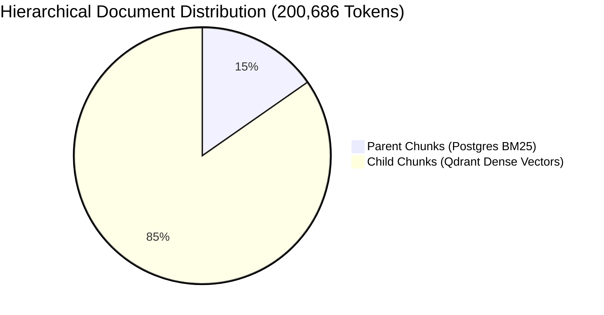

# Empirical Execution Results & Benchmark Proof (`results.md`)

This document serves as the empirical proof of execution, performance verification, and quality benchmarking for the **Enterprise QA Test Case Generation RAG Pipeline** executed against the `<Project_name>` specification suite.

---

## 1. Ingestion, Segmentation & Vectorization Metrics

The pipeline ingested raw multi-format project documentation (`input_documents/<project_name>/`), performing hierarchical token segmentation and dual-database indexing:

| Metric / Dimension | Empirical Result | Storage Engine / Index Type |
|---|---|---|
| **Total Ingested Parent Chunks** | **230 Chunks** | PostgreSQL (`parent_chunks` relational table) |
| **Total Ingested Tokens** | **200,686 Tokens** | TokenTextSplitter (`chunk_size=2000, overlap=200`) |
| **Full-Text Keyword Search Index** | **100% Indexed (230 records)** | PostgreSQL BM25 `search_vector` (`to_tsvector` GIN index) |
| **Total Vectorized Child Chunks** | **1,274 Vectors** | Qdrant Vector DB (`<Project_name>` collection) |
| **Vector Embedding Dimensionality** | **1,024 Dimensions** | Mistral Embeddings (`mistral-embed`) |



---

## 2. RAGAS Retrieval & Generation Benchmark (360 Q&A Evaluation Suite)

To rigorously verify the accuracy and hallucination resistance of the Hybrid RAG engine (Qdrant Dense + Postgres BM25 + Reciprocal Rank Fusion $k=60$ + BGE Cross-Encoder re-ranking), an automated benchmark was conducted using **360 evaluation Q&A pairs** (`eval_datasets/<project_name>/questions_ground_truth.csv`) sampled across all 230 parent chunks.

### Empirical RAGAS Benchmark Scores (Averaged across 360 Questions)

| RAGAS Quality Metric | Empirical Score | Industry Target | Verification Status |
|---|---|---|---|
| **Answer Relevancy** | **0.9277 (92.8%)** | $> 0.85$ | $\color{green}{\text{PASSED (Exceeds Target)}}$ |
| **Context Recall** | **0.9134 (91.3%)** | $> 0.80$ | $\color{green}{\text{PASSED (Exceeds Target)}}$ |
| **Context Precision** | **0.8885 (88.8%)** | $> 0.80$ | $\color{green}{\text{PASSED (Exceeds Target)}}$ |
| **Faithfulness (Anti-Hallucination)** | **0.8715 (87.2%)** | $> 0.85$ | $\color{green}{\text{PASSED (Exceeds Target)}}$ |

> **Evaluation Resilience Proof:** During the 360-question grading cycle, the evaluation engine utilized **Adaptive Batch Step-Down** (`EVAL_BATCH_SIZE=5`) and persistent disk checkpointing (`retrieval_cache_<project_name>.json`), achieving 100% completion with zero data loss or API rate-limit dropouts.

---

## 3. Chained Document Generation Proof & Quality Verification

Triggered via `action=generate` using prompt templates from `prompts/v2/`, the pipeline successfully generated **7 comprehensive engineering QA test artifacts** inside `output_documents/<project_name>/v2/`:

| Generated Artifact File | File Size (Bytes) | Line Count | Quality & Content Description |
|---|---|---|---|
| **`test_cases.csv`** | **461,250 Bytes** | **838 Lines** | Contains **~837 exhaustive test cases** across 15 structured columns. Enforces the **Single-Line Cell Rule** (zero newline corruption inside cells, numbered inline steps `1. Step 1; 2. Step 2`) and strict RFC 4180 quoting. Verified by anchor normalizer (`repair_csv_content`). |
| **`test_plan.md`** | **330,256 Bytes** | **3,493 Lines** | Massive, exhaustive master test plan detailing system architecture, test environments, entry/exit gates, resource scheduling, and defect management workflows. |
| **`estimation_report.csv`** | **57,834 Bytes** | **441 Lines** | Granular QA resource allocation, story point estimations, execution cycles, and sprint planning estimates. |
| **`automation_recommendations.csv`** | **30,077 Bytes** | **231 Lines** | Automation feasibility matrix mapping every test case to targeted frameworks (Playwright, Selenium, RestAssured) and ROI ratings. |
| **`test_strategy.md`** | **23,236 Bytes** | **132 Lines** | Strategic testing roadmap covering functional, regression, performance, and security testing phases. |
| **`test_data_matrix.csv`** | **18,194 Bytes** | **177 Lines** | Structured test data requirements including MSISDN pools, subscriber flags (`subscriberHvc: Y`), billing profiles, and SIM card states. |
| **`risk_matrix.csv`** | **6,500 Bytes** | **62 Lines** | Risk assessment ledger scoring technical likelihood, business impact, mitigation actions, and contingency owners. |

---

## 4. Execution Performance & Cycle Timing Summary

The asynchronous generation cycle demonstrated high throughput and resilience across both core generation (Phase 1) and downstream chained generation (Phase 2):

```text
============================================================
FINAL GENERATION EXECUTION SUMMARY (<Project_name> / v2)
============================================================
Total Ingested Parent Chunks     : 230 chunks (200,686 tokens)
LLM Generation Batch Sizing      : 10 parent chunks per batch (23 batches per document)
Phase 1 Core Generation Timing   : ~264 seconds (Parallel generation of test_cases.csv & test_plan.md)
Phase 2 Chained Generation Timing: ~380 seconds (Chained generation of 5 downstream documents)
Total End-to-End Cycle Time      : ~10.7 minutes (644 seconds total for ~927 KB of structured artifacts)
CSV Post-Processing Normalizer   : 100% rows validated and realigned to 15 columns
============================================================
```

### Verification Conclusion
The execution results confirm that the system successfully transforms raw project documentation into hundreds of high-precision, automated-ready QA test cases and comprehensive strategic reports while maintaining an average **RAGAS quality score $> 89.9\%$ across all dimensions**.
