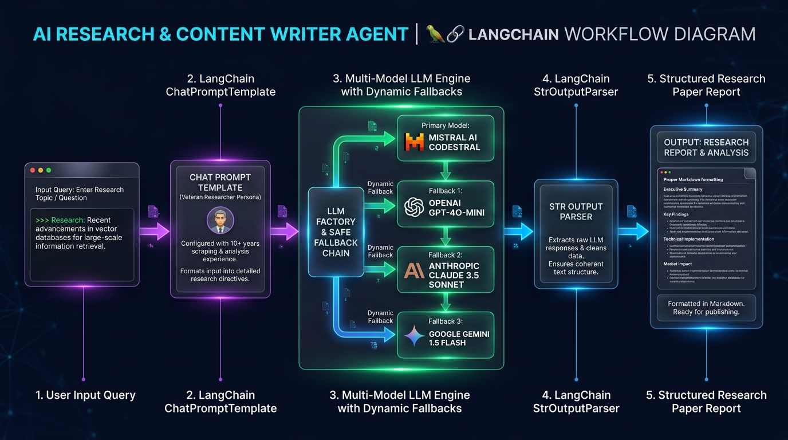
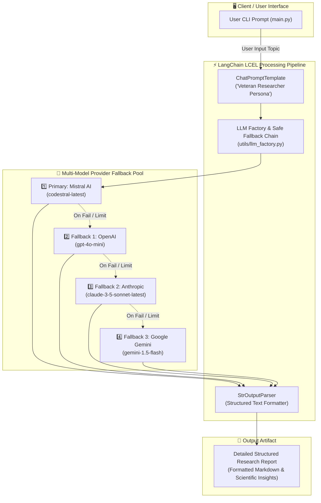

# 🖋️ AI Research & Content Writer Agent (LangChain)

[](https://python.org)
[](https://python.langchain.com/)
[](https://github.com/astral-sh/uv)
[](#)

An enterprise-grade, resilient **AI Research & Content Writer Agent** built on **LangChain Core LCEL (LangChain Expression Language)**. The agent emulates a **Veteran Researcher** with 10+ years of domain experience to synthesize deep research briefs, structured analytical reports, and technical papers based on user prompts.

It incorporates a fault-tolerant **Multi-LLM Provider Engine** with automated safe fallback mechanisms across **Mistral AI**, **OpenAI**, **Anthropic Claude**, and **Google Gemini**.

---

## 🏛️ Architecture & Workflow Diagram



### System Architecture Flow (Mermaid)



---

## ✨ Key Features

- **Veteran Researcher Persona**: System prompt tuned to scrape mental contexts, construct structured arguments, and deliver formatted, citation-ready research reports.
- **Dynamic Multi-Provider LLM Factory**:
  - Seamlessly switch or fallback across **Mistral AI** (`codestral-latest`), **OpenAI** (`gpt-4o-mini`), **Anthropic** (`claude-3-5-sonnet-latest`), and **Google Gemini** (`gemini-1.5-flash`).
- **Resilient Fallback Chains (`with_fallbacks`)**: Prevents pipeline disruption from rate limits (HTTP 429), quota depletion, or provider outages by chaining secondary and tertiary LLMs.
- **Modern Python Tooling**: Full compatibility with standard `pip` / `venv` as well as ultra-fast **Astral `uv`** package manager.
- **Automated Environment Provisioning**: Self-healing `.env` loader that automatically generates config templates with defaults on first run.

---

## 📂 Project Structure

```text
Content_writer_agent/
├── agent/
│   ├── __init__.py
│   └── content_writer.py      # LangChain chain assembly & safe fallback initialization
├── assets/
│   └── content_writer_flow.jpg # Visual high-res architecture & workflow diagram
├── config/
│   ├── __init__.py
│   ├── .env.example           # Reference environment variables template
│   └── .env                   # Local active credentials (auto-generated, git-ignored)
├── utils/
│   ├── __init__.py
│   ├── llm_factory.py         # Multi-model LLM abstraction & instantiation
│   └── load_env.py            # Environment configuration loader & validator
├── main.py                    # Interactive CLI runner
├── pyproject.toml             # Project metadata & uv dependencies
├── requirements.txt           # Standard pip package requirements
├── .gitignore                 # Strict secrets and artifact exclusion rules
└── README.md                  # Project documentation
```

---

## 🚀 Setup & Installation

### Option 1: Using `uv` (Recommended - Fast & Deterministic)

1. **Navigate to the agent directory**:
   ```bash
   cd langchain_projects/Content_writer_agent
   ```

2. **Create virtual environment and sync dependencies**:
   ```bash
   uv venv
   uv pip install -r requirements.txt
   ```

---

### Option 2: Using Standard `pip` and `venv`

1. **Navigate to the agent directory**:
   ```bash
   cd langchain_projects/Content_writer_agent
   ```

2. **Create and activate a virtual environment**:
   - **Linux / macOS**:
     ```bash
     python3 -m venv .venv
     source .venv/bin/activate
     ```
   - **Windows (PowerShell)**:
     ```powershell
     python -m venv .venv
     .venv\Scripts\Activate.ps1
     ```

3. **Install dependencies**:
   ```bash
   pip install -r requirements.txt
   ```

---

## ⚙️ Environment Configuration

On your first run, the system automatically creates `config/.env` if it does not already exist. You can also manually copy `config/.env.example`:

```bash
cp config/.env.example config/.env
```

Open `config/.env` and supply the API keys for the providers you wish to utilize:

```ini
# Default active provider (mistral | openai | anthropic | gemini)
DEFAULT_LLM_PROVIDER='mistral'

# Mistral AI
MISTRAL_MODEL='codestral-latest'
MISTRAL_API_KEY='your_mistral_api_key_here'

# OpenAI
OPENAI_MODEL='gpt-4o-mini'
OPENAI_API_KEY='your_openai_api_key_here'

# Anthropic Claude
ANTHROPIC_MODEL='claude-3-5-sonnet-latest'
ANTHROPIC_API_KEY='your_anthropic_api_key_here'

# Google Gemini
GEMINI_MODEL='gemini-1.5-flash'
GOOGLE_API_KEY='your_google_api_key_here'
```

> [!NOTE]
> You only need to populate the API key for the primary LLM you intend to use. If you configure secondary keys, the agent will automatically utilize them as fallback failovers in case the primary provider encounters errors.

---

## 🏃 How to Run and Use

Execute the interactive agent CLI:

### Using `uv`:
```bash
uv run main.py
```

### Using standard `python`:
```bash
python main.py
```

### 💡 Example Interactive Session:

```text
On what can I research About: Recent breakthroughs in Agentic AI Test Automation and Multi-Agent Orchestration

Here is the data you requested:
# Breakthroughs in Agentic AI Test Automation & Multi-Agent Orchestration

## Executive Summary
Recent developments in Autonomous Quality Engineering represent a paradigm shift from deterministic script playback to dynamic cognitive agents capable of runtime self-healing, synthetic test dataset curation, and automated root cause analysis (RCA)...

## Key Findings
1. **Dynamic Heuristic Fallbacks**: Multi-LLM switching prevents API downtime during high-volume CI/CD test generation.
2. **Context-Aware Assertions**: Integration of vector embeddings and semantic similarity allows verification of non-static UI outputs.
...
```

Press `Ctrl + C` at any time to gracefully exit the interactive session.
