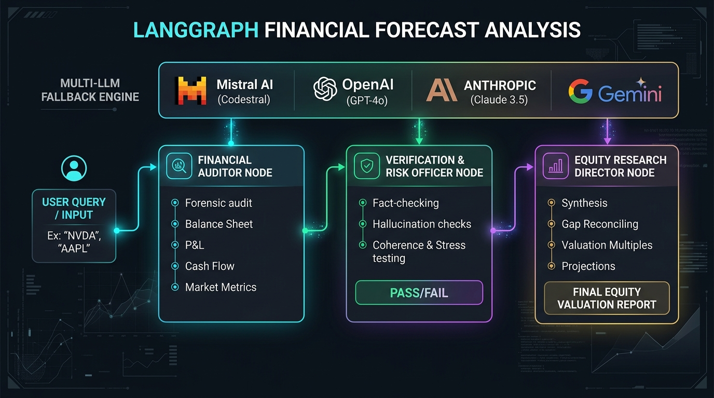
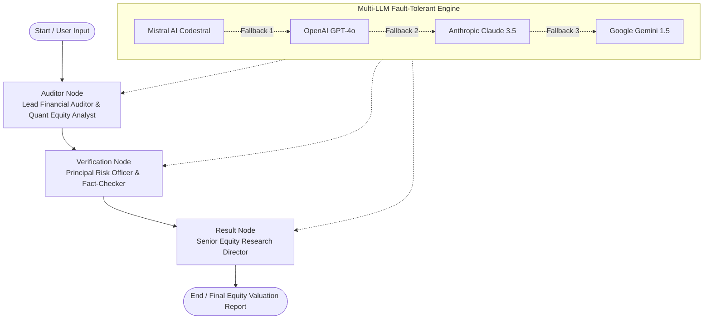

# LangGraph Financial Forecast & Equity Research Multi-Agent Pipeline

[](https://python.org)
[](https://python.langchain.com/docs/langgraph)
[](https://python.langchain.com/)
[](#)

An enterprise-grade, multi-stage financial research and forensic equity valuation agent pipeline built with **LangGraph** and **LangChain**. It autonomously conducts deep fundamental audits, forensic balance sheet & cash flow scrutiny, independent risk fact-checking, and generates executive-grade equity valuation reports with predictive forward-looking projections.

---

## 🏛️ System Architecture

The pipeline orchestrates a **3-stage LangGraph StateGraph** coupled with a **Multi-LLM Fallback Engine** ensuring zero downtime and high-resilience execution.



### State Machine Workflow



---

## 🔍 What the Tool Does

1. **Forensic Accounting & Fundamental Audit (Auditor Node)**:
   - Evaluates Income Statements, Balance Sheets, and Cash Flow Statements (TTM & 3-year historical).
   - Audits liquidity ratios (Current/Quick), leverage ratios (Debt-to-Equity, Interest Coverage), margin trajectories, and Free Cash Flow (FCF) conversion rates.
   - Assesses legal and regulatory disclosures, pending SEC inquiries, M&A goodwill impairments, and contingent liabilities.

2. **Independent Risk Verification & Anti-Hallucination (Verification Node)**:
   - Functions as an independent Principal Risk Officer.
   - Critically cross-examines numbers, dates, multiples, and ratios against logical coherence.
   - Flags speculative hype or emotional bias and outputs a structured validation audit (`PASS / NEEDS REVISION / FAIL`).

3. **Executive Synthesis & Valuation Modeling (Result Node)**:
   - Synthesizes findings and resolves any flagged risk gaps.
   - Models market multiples (P/E, EV/EBITDA, P/S, P/B) against industry benchmarks.
   - Provides revenue projections, downside risk scenarios, earnings outlooks, and definitive investment verdicts.

---

## 📂 Project Structure

```text
langgraph_financial_forcast_analysis/
├── agents/
│   ├── __init__.py
│   └── financial_researcher_agent.py   # LangGraph StateGraph (Auditor, Verification, Result nodes)
├── configs/
│   ├── .env.example                    # Sample environment variables & API keys
│   └── .env                            # Local environment configuration (git-ignored)
├── utils/
│   ├── __init__.py
│   ├── load_env.py                     # Safe multi-directory .env loader
│   └── llm_factory.py                  # Dynamic Multi-LLM provider & fallback factory
├── financial_forecast_architecture.png # Architecture & flow visualization
├── main.py                             # Interactive CLI entry point
├── pyproject.toml                      # Project metadata
├── requirements.txt                    # Pip dependencies
└── README.md                           # Documentation
```

---

## ⚡ Multi-LLM Fallback Mechanism

The engine implements dynamic, multi-tiered fallback orchestration:

```python
llm = llm_fallback(
    primary_llm=get_llm("mistral"),
    fallback_llms=[get_llm("openai"), get_llm("anthropic"), get_llm("gemini")]
)
```

If the primary provider faces rate-limits, downtime, or network failures, requests are smoothly routed to OpenAI, Anthropic, or Google Gemini with zero disruption.

---

## 🚀 Getting Started

### 1. Prerequisites
- Python 3.10+
- API keys for at least one supported LLM provider (Mistral AI, OpenAI, Anthropic, or Google Gemini)

### 2. Installation

Clone the repository and navigate to the project directory:

```bash
cd langchain_module_projects/langgraph_financial_forcast_analysis
```

Create a virtual environment and install dependencies:

```bash
# Using standard venv
python -m venv .venv
source .venv/bin/activate  # On Windows: .venv\Scripts\activate
pip install -r requirements.txt

# Or using uv (recommended for ultra-fast installs)
uv sync
```

### 3. Configure Environment Variables

Copy the example environment file and insert your API keys:

```bash
cp configs/.env.example configs/.env
```

Edit `configs/.env`:
```env
DEFAULT_LLM_PROVIDER='mistral'

# Provider API Keys
MISTRAL_API_KEY='your_mistral_api_key_here'
MISTRAL_MODEL='codestral-latest'

OPENAI_API_KEY='your_openai_api_key_here'
OPENAI_MODEL='gpt-4o-mini'

ANTHROPIC_API_KEY='your_anthropic_api_key_here'
ANTHROPIC_MODEL='claude-3-5-sonnet-latest'

GOOGLE_API_KEY='your_google_gemini_api_key_here'
GEMINI_MODEL='gemini-1.5-flash'
```

### 4. Run the Agent

Execute the interactive CLI:

```bash
python main.py
```

Enter any company ticker, asset, or financial question (e.g. `NVIDIA (NVDA)`, `Apple (AAPL)`, `Microsoft (MSFT)`):

```text
Enter your query: NVIDIA (NVDA)
```

---

## 📊 Sample Output Deliverable

Below is an excerpt of the generated institutional report structure:

```markdown
# Comprehensive Financial Audit & Equity Valuation Report: NVIDIA Corporation (NVDA)

## 1. Executive Summary & Verdict
- **Verdict**: STRONG FINANCIAL HEALTH / EXPANDING MOAT
- **Audit Summary**: Robust free cash flow conversion, industry-leading gross margins (~75%), and minimal long-term debt leverage. Revenue accelerated by datacenter AI acceleration demand.

## 2. Core Financial Performance & Cash Flow
- **Revenue Trajectory**: TTM Revenue surged >120% YoY driven by Compute & Networking segments.
- **Cash Flow Dynamics**: Operating Cash Flow remains exceptionally strong with >85% conversion to Free Cash Flow.
- **Per-Share Metrics**: Diluted EPS expanded substantially; capital allocation prioritized R&D and strategic buybacks.

## 3. Strategic Audit: Strengths, Weaknesses & Risk Gaps
- **Key Strengths**: CUDA software lock-in, supply chain integration with TSMC, dominant market share in AI accelerators.
- **Vulnerabilities**: Customer concentration risk among top hyperscalers, export restrictions, potential cyclicality in hardware upgrade cycles.
- **Risk Officer Verification**: PASS - Audited metrics and margin dynamics validated against official SEC disclosures.

## 4. Forward-Looking Projections & Growth Trajectory
- **Base Case**: Projected forward CAGR of 25-30% over the next 24 months supported by next-gen architecture rollout.
- **Downside Risks**: Hyperscaler custom silicon adoption and geopolitical headwinds.

## 5. Stock Price, Options & Equity Valuation Analysis
- **Valuation Multiples**: Forward P/E at 35x, EV/EBITDA aligned with superior growth profile.
- **Fair Value Estimate**: Priced for sustained growth; premium justified by return on invested capital (ROIC > 55%).
```

---

## 🛠️ Tech Stack

- **Framework**: [LangGraph](https://python.langchain.com/docs/langgraph) (Cyclic/Stateful Multi-Agent Workflows)
- **Orchestration**: [LangChain Core](https://python.langchain.com/) & [LangChain Community](https://github.com/langchain-ai/langchain)
- **Supported LLMs**: Mistral AI, OpenAI GPT-4o, Anthropic Claude 3.5 Sonnet, Google Gemini
- **Environment Management**: Python-dotenv
- **Package Management**: Pip / Astral `uv`
