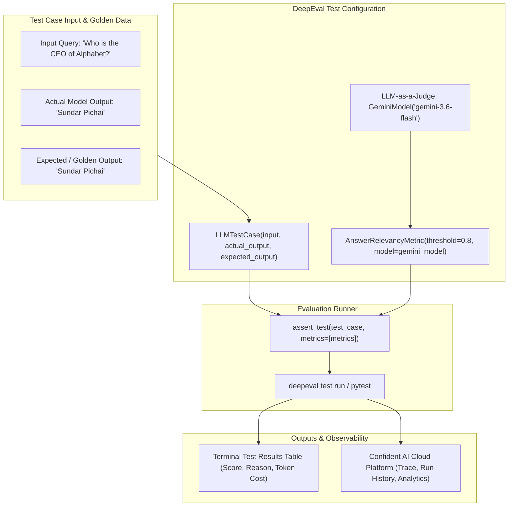
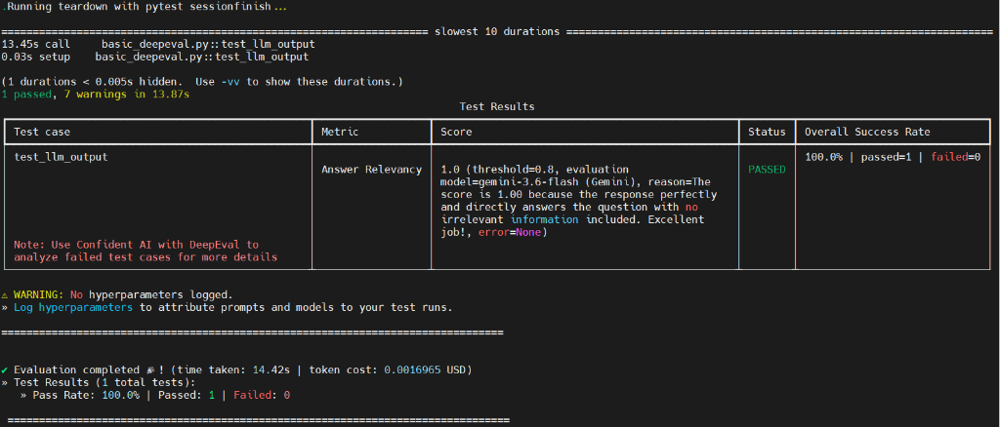
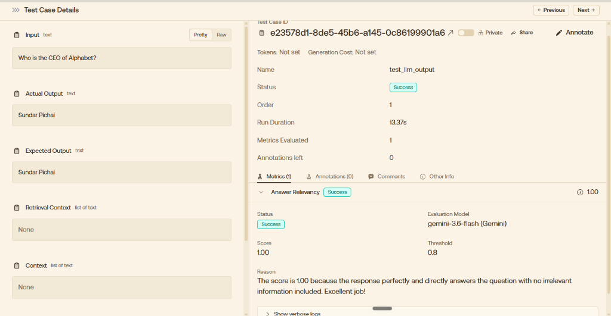

# LLM Evaluation Projects

[](https://python.org)
[](https://confident-ai.com)
[](https://ai.google.dev/)
[](https://pytest.org)
[](https://app.confident-ai.com)

A specialized LLM unit-testing and evaluation suite designed to validate Generative AI outputs, RAG pipelines, and conversational agents using **DeepEval**, **Confident AI**, and **LLM-as-a-Judge** scoring metrics powered by **Google Gemini**.

---

## 📌 Overview

Evaluating Large Language Models (LLMs) requires moving beyond traditional string matching assertions. This project implements enterprise-grade LLM evaluation patterns using **DeepEval** and **Pytest** to quantitatively score actual model responses against inputs and golden datasets across critical evaluation metrics like **Answer Relevancy**, **Faithfulness**, and **Contextual Alignment**.

---

## 🏗️ Architecture & Evaluation Flow



---

## 📂 Directory Structure

```text
llm_eval_projects/
├── deepeval_baisc/
│   ├── assets/
│   │   ├── confident_ai_dashboard.png    # Confident AI evaluation platform screenshot
│   │   └── pytest_deepeval_run.png       # Pytest & DeepEval terminal execution output
│   ├── configs/
│   │   ├── .env.example                  # Environment template for API keys
│   │   └── .env                          # Local credentials (git-ignored)
│   ├── .gitignore                        # DeepEval cache and secrets ignore rules
│   └── basic_deepeval.py                 # DeepEval test case with Gemini Judge & Answer Relevancy
└── README.md                             # LLM Evaluation documentation
```

---

## 📸 Evaluation Results & Observability

### 1. Pytest & DeepEval Execution Summary
The evaluation executes as a standard Pytest test run, producing metric scoring, token cost estimations, latency measurements, and judge reasoning:



* **Test Case**: `test_llm_output`
* **Metric**: `Answer Relevancy`
* **Score**: `1.0 / 1.0` (Threshold: `0.8`)
* **Evaluation Model**: `gemini-3.6-flash (Gemini)`
* **LLM Judge Reasoning**: *"The score is 1.00 because the response perfectly and directly answers the question with no irrelevant information included. Excellent job!"*
* **Pass Rate**: `100.0%`
* **Execution Duration**: `13.45s`
* **Token Cost**: `$0.0016965 USD`

---

### 2. Confident AI Cloud Observability Platform
DeepEval seamlessly integrates with [Confident AI](https://app.confident-ai.com) to provide visual test run tracking, historical regression monitoring, and deep metric breakdowns:



---

## 🚀 Setup & Execution Guide

### Prerequisites
* **Python**: `3.10` or higher
* **Google Gemini API Key**: [Google AI Studio](https://aistudio.google.com/)
* *(Optional)* **Confident AI API Key**: [Confident AI](https://app.confident-ai.com)

### 1. Install Dependencies
Navigate to the project directory and install the required packages:

```bash
cd llm_eval_projects/deepeval_baisc
pip install deepeval python-dotenv pytest
```

### 2. Configure Environment Variables
Copy `.env.example` to `.env` in the `configs/` directory and configure your Google API key:

```bash
# Windows (PowerShell)
Copy-Item configs/.env.example configs/.env

# Linux / macOS / Bash
cp configs/.env.example configs/.env
```

Open `configs/.env` and insert your API credentials:

```ini
# Google Gemini API Key for LLM Judge Evaluation
GOOGLE_API_KEY=your_google_gemini_api_key_here

# Optional: Confident AI Cloud Logging
# CONFIDENT_AI_API_KEY=your_confident_ai_api_key_here
```

### 3. (Optional) Login to Confident AI
To synchronize evaluation test runs and view visual reports on Confident AI:

```bash
deepeval login
```

---

## 💻 Running the Evaluation Tests

### Option A: Using DeepEval CLI (Recommended)
The DeepEval CLI formats evaluation results in a detailed summary table:

```bash
deepeval test run basic_deepeval.py
```

### Option B: Using Pytest Directly
Execute via standard Pytest:

```bash
pytest basic_deepeval.py -s -v
```

---

## 🔍 Code Walkthrough (`basic_deepeval.py`)

```python
# 1. Import DeepEval core components
from deepeval import assert_test
from deepeval.metrics import AnswerRelevancyMetric
from deepeval.test_case import LLMTestCase
from deepeval.models import GeminiModel
from dotenv import load_dotenv, set_key, dotenv_values
from pathlib import Path

# 2. Automatically locate and load configs/.env
CONFIG_FOLDER = Path(__file__).resolve().parent / "configs"
CONFIG_ENV = CONFIG_FOLDER / ".env"

def load_env(path: Path=CONFIG_ENV) -> dict[str, str|None]:
    path.parent.mkdir(parents=True, exist_ok=True)
    if not path.exists():
        path.touch()
        set_key(dotenv_path=path, key_to_set="GOOGLE_API_KEY", value_to_set="")
    load_dotenv(dotenv_path=path, override=True)
    return dict(dotenv_values(dotenv_path=path))

load_env()

# 3. Instantiate Google Gemini as the LLM Evaluation Judge
gemini_model = GeminiModel(model="gemini-3.6-flash")

# 4. Define the evaluation metric and passing threshold
metrics = AnswerRelevancyMetric(threshold=0.8, model=gemini_model)

# 5. Define the LLM test case (input query, actual output, expected golden output)
test_case = LLMTestCase(
    input="Who is the CEO of Alphabet?",
    actual_output="Sundar Pichai",
    expected_output="Sundar Pichai"
)

# 6. Execute assertion test
def test_llm_output():
    assert_test(test_case=test_case, metrics=[metrics])
```

---

## 📊 Supported LLM Evaluation Metrics

| Metric | Purpose | Judge / Measurement |
| :--- | :--- | :--- |
| **Answer Relevancy** | Assesses how relevant and direct the response is to the input query without redundant info. | LLM Judge (`Gemini 3.6 Flash`) |
| **Faithfulness** | Validates whether the actual response is strictly grounded in retrieved context (Zero Hallucination). | Context Retrieval + LLM Judge |
| **Contextual Precision** | Measures if relevant context chunks are ranked higher in the retrieval pipeline. | Reranker / LLM Judge |
| **Contextual Recall** | Measures whether all relevant ground truth facts are captured in the retrieved context. | Golden Reference + LLM Judge |
| **Hallucination Metric** | Calculates the proportion of hallucinated statements within the actual output. | Ground Truth Verification |

---

## 🛠️ Best Practices for CI/CD Integration
* **Deterministic Thresholds**: Set minimum passing thresholds (e.g. `0.80` or `0.85`) to fail builds if regression occurs.
* **Cost Tracking**: Monitor token consumption per test case to keep automated CI test execution lean and cost-effective.
* **Golden Dataset Management**: Version control golden test sets alongside unit tests to ensure consistent benchmarking across prompt updates and model upgrades.
