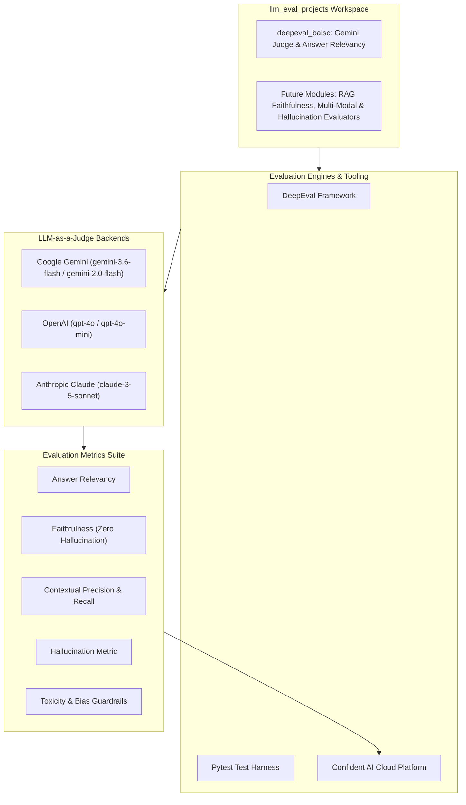

# LLM Evaluation Projects

[](https://python.org)
[](https://confident-ai.com)
[](https://ai.google.dev/)
[](https://pytest.org)
[](https://app.confident-ai.com)

A centralized suite of LLM evaluation frameworks, unit-testing modules, and benchmarking tools engineered to systematically assess, grade, and safeguard Generative AI applications, RAG pipelines, and autonomous agents.

---

## 📌 Workspace Overview

Traditional software testing relies on deterministic binary assertions. In contrast, Generative AI applications require continuous quantitative evaluation across semantic relevancy, factual faithfulness, hallucination risk, and context retrieval quality.

The **`llm_eval_projects`** directory contains modular, plug-and-play evaluation projects implementing leading evaluation frameworks like **DeepEval**, **Confident AI**, and **LLM-as-a-Judge** scoring engines.

---

## 📂 Included Evaluation Projects

| Project Directory | Description | Core Framework | LLM Judge | Key Metrics |
| :--- | :--- | :--- | :--- | :--- |
| [**`deepeval_baisc`**](./deepeval_baisc/) | Basic LLM unit testing suite with automated assertions and Confident AI observability. | DeepEval + Pytest | Google Gemini (`gemini-3.6-flash`) | Answer Relevancy |

---

## 🏗️ Monorepo LLM Evaluation Architecture



---

## 📊 Comprehensive Metric Taxonomy

| Metric Category | Metric Name | Evaluation Objective | Target Threshold |
| :--- | :--- | :--- | :--- |
| **Response Quality** | **Answer Relevancy** | Assesses whether the model response directly addresses the query without fluff or irrelevant tokens. | $\ge 0.80$ |
| **Response Quality** | **Summarization** | Quantifies how accurately a summary captures key insights from the original text without information distortion. | $\ge 0.85$ |
| **RAG Grounding** | **Faithfulness** | Evaluates whether every claim in the response is strictly supported by the retrieved context. | $\ge 0.90$ |
| **RAG Retrieval** | **Contextual Precision** | Measures if relevant context chunks are prioritized and ranked at the top of the retrieval results. | $\ge 0.80$ |
| **RAG Retrieval** | **Contextual Recall** | Measures whether all necessary facts from the golden truth are successfully retrieved. | $\ge 0.85$ |
| **Safety & Trust** | **Hallucination Metric** | Detects and penalizes fabricated or unverified claims. | $\le 0.05$ |
| **Safety & Trust** | **Toxicity / Bias** | Flags toxic, offensive, or biased language in conversational outputs. | $\le 0.01$ |

---

## 🚀 Quick Start Across Projects

To run evaluation suites locally:

1. **Navigate to the target project**:
   ```bash
   cd llm_eval_projects/deepeval_baisc
   ```
2. **Setup environment variables**:
   ```bash
   cp configs/.env.example configs/.env
   # Add your GOOGLE_API_KEY in configs/.env
   ```
3. **Execute the evaluation suite**:
   ```bash
   deepeval test run basic_deepeval.py
   # or
   pytest basic_deepeval.py -s -v
   ```

For detailed project-specific documentation, refer to [`deepeval_baisc/README.md`](./deepeval_baisc/README.md).
