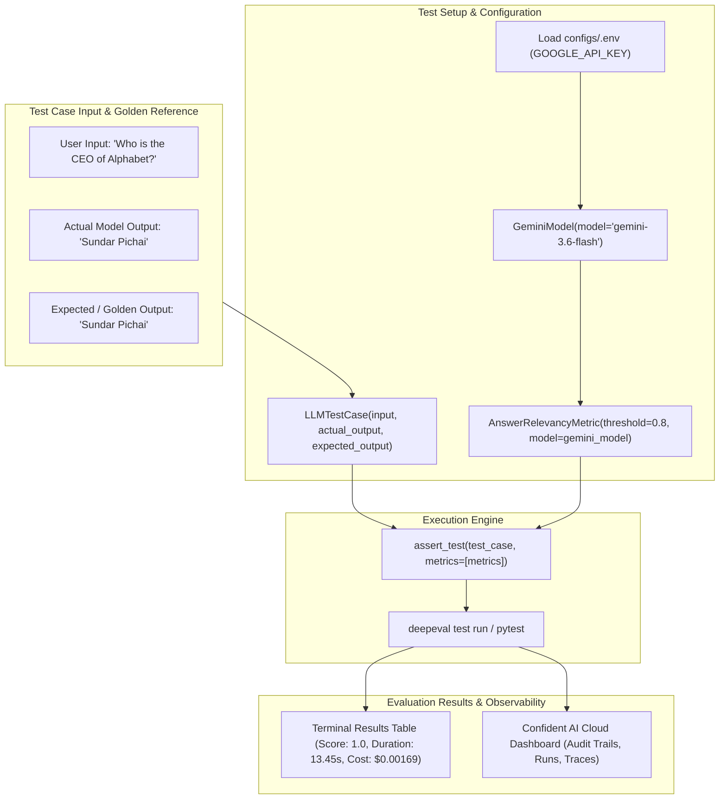

# DeepEval Basic — LLM Unit Testing & Evaluation

[](https://python.org)
[](https://confident-ai.com)
[](https://ai.google.dev/)
[](https://pytest.org)
[](https://app.confident-ai.com)

A hands-on LLM unit-testing project implementing **DeepEval** with **Google Gemini (`gemini-3.6-flash`)** as an LLM-as-a-Judge and **Answer Relevancy Metric** evaluation.

---

## 📌 Overview

This project demonstrates how to construct deterministic, metric-driven unit tests for LLM responses using **DeepEval** and **Pytest**. Instead of crude string comparisons or regex assertions, it employs an advanced LLM judge to evaluate semantic accuracy, relevancy, and conciseness against expected golden outputs.

---

## 🏗️ Evaluation Workflow



---

## 📂 Project Structure

```text
deepeval_baisc/
├── assets/
│   ├── confident_ai_dashboard.png    # Confident AI cloud evaluation dashboard
│   └── pytest_deepeval_run.png       # Pytest & DeepEval terminal execution output
├── configs/
│   ├── .env.example                  # Environment template for API credentials
│   └── .env                          # Local environment file (git-ignored)
├── .gitignore                        # Local gitignore for .deepeval cache & secrets
├── basic_deepeval.py                 # Core evaluation script (test_llm_output)
└── README.md                         # Project-specific documentation
```

---

## 📸 Test Execution & Observability

### 1. Pytest & DeepEval Terminal Output
Running the evaluation generates a detailed test report featuring pass/fail status, metric scores, LLM judge reasoning, latency, and estimated token cost:


* **Test Case**: `test_llm_output`
* **Metric**: `Answer Relevancy`
* **Score**: `1.0 / 1.0` (Threshold: `0.8`)
* **Evaluation Model**: `gemini-3.6-flash (Gemini)`
* **LLM Judge Reasoning**: *"The score is 1.00 because the response perfectly and directly answers the question with no irrelevant information included. Excellent job!"*
* **Pass Rate**: `100.0%`
* **Execution Duration**: `13.45s`
* **Token Cost**: `$0.0016965 USD`

---

### 2. Confident AI Cloud Observability Platform
DeepEval integrates seamlessly with [Confident AI](https://app.confident-ai.com) for real-time telemetry, visual inspection, and metric trend monitoring across test iterations:


---

## 🚀 Setup & Execution Guide

### Prerequisites
* **Python**: `3.10` or higher
* **Google Gemini API Key**: Obtainable from [Google AI Studio](https://aistudio.google.com/)
* *(Optional)* **Confident AI API Key**: [Confident AI Portal](https://app.confident-ai.com)

### 1. Install Dependencies

```bash
cd llm_eval_projects/deepeval_baisc
pip install deepeval python-dotenv pytest
```

### 2. Configure Environment Variables
Copy `configs/.env.example` to `configs/.env`:

```bash
# Windows (PowerShell)
Copy-Item configs/.env.example configs/.env

# Linux / macOS / Bash
cp configs/.env.example configs/.env
```

Set your Google API Key in `configs/.env`:

```ini
# Google Gemini API Key for LLM Judge Evaluation
GOOGLE_API_KEY=your_google_gemini_api_key_here

# Optional: Confident AI Cloud Logging
# CONFIDENT_AI_API_KEY=your_confident_ai_api_key_here
```

### 3. (Optional) Confident AI Cloud Login
To sync evaluation runs to the Confident AI cloud dashboard:

```bash
deepeval login
```

---

## 💻 Running Tests

### Option A: DeepEval Test Runner (Recommended)
```bash
deepeval test run basic_deepeval.py
```

### Option B: Pytest Runner
```bash
pytest basic_deepeval.py -s -v
```

---

## 🔍 Code Walkthrough (`basic_deepeval.py`)

```python
# 1. Imports
from deepeval import assert_test
from deepeval.metrics import AnswerRelevancyMetric
from deepeval.test_case import LLMTestCase
from deepeval.models import GeminiModel
from dotenv import load_dotenv, set_key, dotenv_values
from pathlib import Path
import pytest
import os

# 2. Config & Environment Initialization
CONFIG_FOLDER = Path(__file__).resolve().parent / "configs"
CONFIG_ENV = CONFIG_FOLDER / ".env"

def load_env(path: Path=CONFIG_ENV) -> dict[str, str|None]:
    path.parent.mkdir(parents=True, exist_ok=True)
    if not path.exists():
        path.touch()
        set_key(dotenv_path=path, key_to_set="GOOGLE_API_KEY", value_to_set="")
    load_dotenv(dotenv_path=path, override=True)
    return dict(dotenv_values(dotenv_path=path))

load_env()

# 3. LLM Judge Model
gemini_model = GeminiModel(model="gemini-3.6-flash")

# 4. Evaluation Metric & Threshold
metrics = AnswerRelevancyMetric(threshold=0.8, model=gemini_model)

# 5. Define Test Case
test_case = LLMTestCase(
    input="Who is the CEO of Alphabet?",
    actual_output="Sundar Pichai",
    expected_output="Sundar Pichai"
)

# 6. Assertion & Pre-flight API Key Guard
def test_llm_output():
    # Check if API key is configured; fail gracefully if missing
    if not os.getenv("GOOGLE_API_KEY"):
        pytest.fail("API Key is not configured in .env")

    assert_test(test_case=test_case, metrics=[metrics])
```
