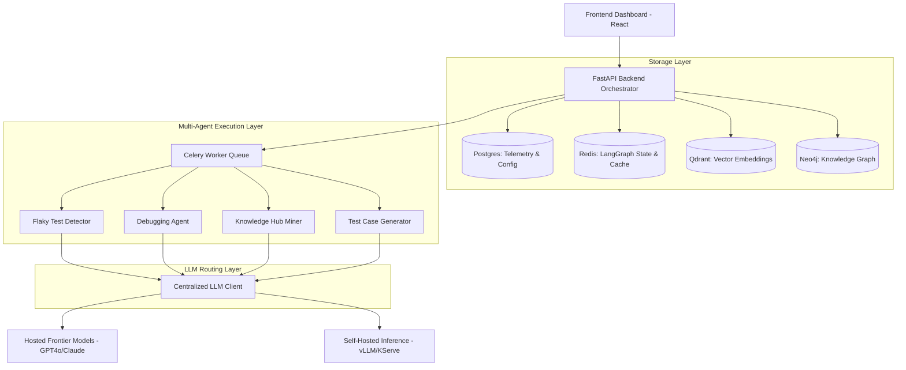
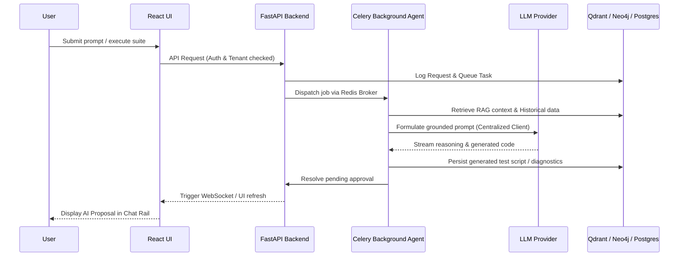

# STLC Agentic Platform

The **STLC Agentic Platform** is a centralized, AI-driven automation orchestrator for modern Software Testing Life Cycles (STLC). It leverages multi-agent workflows—orchestrated via LangGraph—to ingest legacy QA datasets, automatically generate robust API and UI test suites (Playwright/pytest), detect and heal flaky tests, automatically debug execution failures, and centralize automation knowledge into a sharable, graph-backed Knowledge Hub.

## What We Built
In this project, we built a comprehensive, end-to-end automation orchestrator capable of significantly reducing human QA effort. The platform accomplishes the following:
1. **Intelligent Ingestion:** Legacy test cases, Swagger specs, and product documentation are ingested and mapped into a Qdrant Vector Database and Neo4j Graph Database.
2. **Zero-Shot Test Generation:** Generates executable Playwright (UI) and Pytest (API) test suites using LLMs strictly grounded in RAG contexts to avoid hallucination (especially regarding UI locators).
3. **Execution Engine:** Dynamically orchestrates test suite executions securely via Docker, or packages them for disconnected CI/CD execution.
4. **Heuristic Flaky Detection:** Uses statistical variance to identify flaky tests across multiple historical runs, separating real bugs from unstable test environments.
5. **Auto-Debugging:** Analyzes broken tests and logs, utilizing Semantic Response Caching to fix code without wasting LLM tokens on identical, repetitive failures.
6. **Central Knowledge Hub:** Employs Machine Learning clustering (`hdbscan`) to mine executed test scripts, extract reusable automation strategies, and share them securely across tenant projects.
7. **Cost Analytics & Reporting:** Aggregates and displays detailed telemetry on LLM token costs per agent and model.
8. **Self-Hosted Inference:** Provides a deployable architecture (via Kubernetes and KServe) to route high-volume tasks to localized models running on GPUs (vLLM) while preserving expensive frontier models for heavy reasoning tasks.

## Architecture Diagram



## Data Flow Diagram



## Agents Used
1. **RAG Ingestion Agent:** Processes text, swagger, and logs, segmenting and embedding them into Qdrant for semantic search and Neo4j for relationship mapping.
2. **RAG Retrieval Agent:** Dynamically traverses the vector DB and knowledge graph to build grounded context payloads before any code is generated.
3. **Test Case Generator Agent:** Writes Playwright/Pytest code. Strictly forbidden from hallucinating locators; uses `get_interactive_elements()` and RAG contexts to write deterministic tests.
4. **RAGAS Evaluator Agent:** An observer agent that grades the Test Case Generator's outputs based on context precision, recall, and faithfulness.
5. **Flaky Test Detector Agent:** A statistical agent running on a Cron schedule. Analyzes historical intra-run and inter-run execution logs to identify tests that randomly bounce between pass/fail.
6. **Debugging Agent:** Automatically catches test failures. It checks a specialized Semantic Cache first, and if unknown, asks the LLM to root-cause the stack trace.
7. **Knowledge Hub Miner Agent:** Runs twice daily, grouping execution scripts into ML clusters (`hdbscan`). If a new pattern emerges (e.g. a new authentication flow), it triggers the LLM to write a reusable "Skill" card for other testers.
8. **Reporting Agent:** A programmatic (zero-LLM) engine that generates HTML dashboards mapping out executions and evaluating pipeline health.

## Tech Stack
- **Frontend:** React, TypeScript, TailwindCSS, Vite, Chart.js, Lucide Icons.
- **Backend:** Python 3.12, FastAPI, LangGraph, LangChain, Celery.
- **AI/LLM:** OpenAI, Anthropic, Gemini, Mistral, Ollama, vLLM.
- **Databases:** PostgreSQL (Relational & Caching), Redis (Message Broker & State), Qdrant (Vector DB), Neo4j (Knowledge Graph).
- **Deployment:** Docker, Docker Compose, Kubernetes, Helm, KServe (for local LLM autoscaling), Systemd.

## Project Structure
```
stlc-agentic-tool/
├── backend/
│   ├── core/           # LLM clients, pricing, auth, DB configuration
│   ├── routers/        # FastAPI endpoints (Orchestrator, RAG Eval, Cost, Approvals, Knowledge Hub)
│   ├── tasks/          # Celery Workers (Flaky Detector, Debugger, Knowledge Hub Miner)
│   └── main.py         # Application entrypoint
├── frontend/
│   ├── src/
│   │   ├── components/ # Reusable UI pieces (ChatRail, ReviewModal, Cards)
│   │   ├── layout/     # AppShell (Sidebar navigation)
│   │   └── pages/      # Dashboards (Test Suites, Executions, Cost Analysis, RAG Eval, Knowledge Hub)
│   └── package.json
├── charts/             # Helm charts for Kubernetes deployment
├── docs/               # Advanced deployment guides (Bare Metal, WSL2)
├── docker-compose.yml  # Local development stack
└── .env                # Global configuration
```

## Setup and Usage
To install and deploy the platform locally, on Bare-Metal Linux, or in a Kubernetes cluster, please refer to the [INSTALLER.md](INSTALLER.md).

## How to Use the Platform
For a detailed step-by-step guide on how to upload context files for RAG ingestion, trigger the Test Generator agents, and utilize the auto-debugger, please read the **[User Guide & Setup (setup.md)](setup.md)**.
